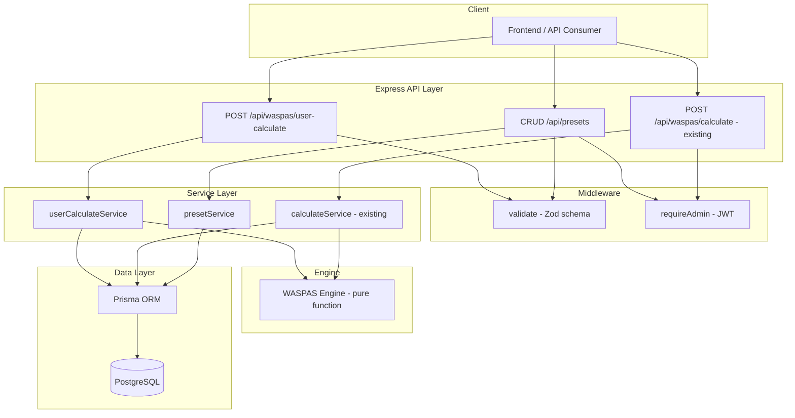
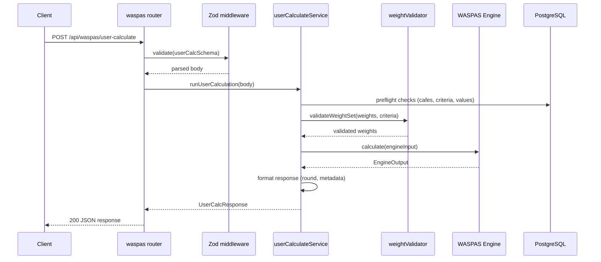
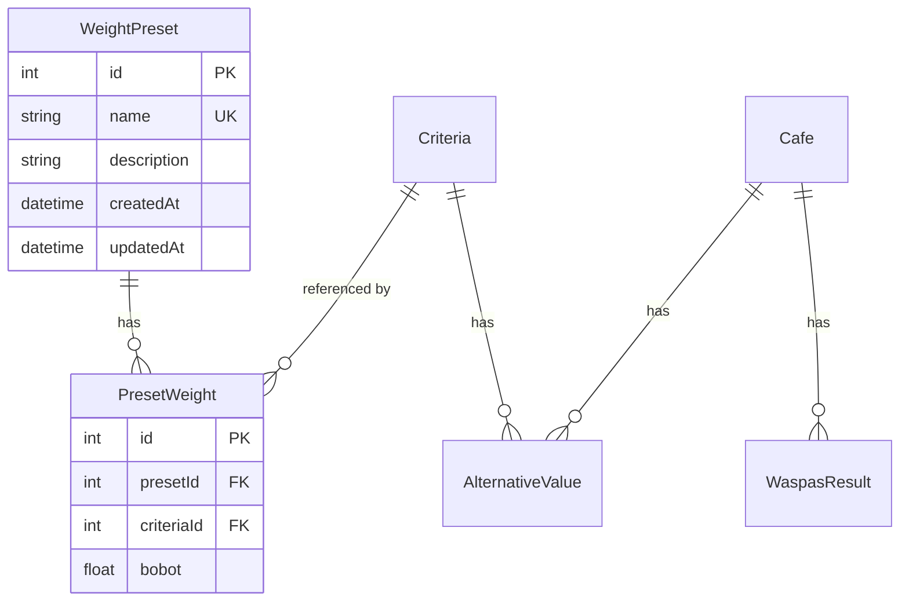

# Design Document: Dynamic User Weighting

## Overview

This design extends the SPK WASPAS backend to allow end-users to submit personalized criteria weights for on-the-fly calculations without modifying global admin-configured weights. The feature introduces:

1. A **public calculation endpoint** (`POST /api/waspas/user-calculate`) that accepts inline weights, a preset reference, or falls back to global defaults.
2. A **Weight Preset CRUD system** allowing admins to manage named, reusable weight configurations.
3. A **configurable lambda parameter** giving users control over the WSM/WPM balance.
4. **Strict weight validation** ensuring mathematical consistency before any calculation.

The existing admin-triggered calculation (`POST /api/waspas/calculate`) remains unchanged and continues to persist results to the `WaspasResult` table.

### Design Rationale

- **Stateless user calculations**: User requests are pure — no database writes — keeping the persisted ranking admin-controlled.
- **Reuse of the existing WASPAS engine**: The `calculate()` function in `src/engine/waspas.ts` is already a pure function accepting weights via `EngineInput.criterias[].bobot`. We override these values at the service layer without modifying the engine.
- **Shared validation**: A single `validateWeightSet()` utility serves both inline weights and preset weights, ensuring consistency.

## Architecture



### Request Flow: User Calculation



## Components and Interfaces

### New Files

| File | Purpose |
|------|---------|
| `src/routes/presets.ts` | Express router for Weight Preset CRUD |
| `src/services/userCalculateService.ts` | Orchestrates user-facing stateless calculations |
| `src/services/presetService.ts` | Business logic for preset management |
| `src/services/weightValidator.ts` | Shared weight set validation utility |
| `src/repositories/presetRepository.ts` | Prisma data access for `WeightPreset` model |

### Modified Files

| File | Change |
|------|--------|
| `src/routes/waspas.ts` | Add `POST /user-calculate` route |
| `src/app.ts` | Register `/api/presets` router |
| `prisma/schema.prisma` | Add `WeightPreset` and `PresetWeight` models |

### Interface Definitions

```typescript
// src/services/weightValidator.ts
export interface WeightEntry {
  criteriaId: number;
  bobot: number;
}

export interface ValidatedWeightSet {
  weights: WeightEntry[];
  sum: number; // Should be 1.0 ± 0.001
}

export function validateWeightSet(
  weights: WeightEntry[],
  existingCriteria: { id: number }[]
): ValidatedWeightSet; // throws AppError(422) on failure
```

```typescript
// src/services/userCalculateService.ts
export interface UserCalcRequest {
  weights?: WeightEntry[];
  presetId?: number;
  lambda?: number;
}

export interface UserCalcResult {
  results: UserResultEntry[];
  weights: WeightEntry[];
  lambda: number;
  keunggulan: string[];
  metadata: {
    weightSource: "inline" | "preset" | "default";
    presetName?: string;
    calculatedAt: string; // ISO 8601
  };
}

export interface UserResultEntry {
  ranking: number;
  cafeId: number;
  cafe: { kode: string; nama: string };
  wsm: number;  // rounded to 4 decimal places
  wpm: number;  // rounded to 4 decimal places
  qi: number;   // rounded to 4 decimal places
}

export function runUserCalculation(req: UserCalcRequest): Promise<UserCalcResult>;
```

```typescript
// src/services/presetService.ts
export interface CreatePresetInput {
  name: string;
  description?: string;
  weights: WeightEntry[];
}

export interface UpdatePresetInput {
  name?: string;
  description?: string;
  weights?: WeightEntry[];
}
```

### Zod Schemas

```typescript
// Request schema for POST /api/waspas/user-calculate
const userCalcSchema = z.object({
  weights: z.array(z.object({
    criteriaId: z.number().int().positive(),
    bobot: z.number().min(0).max(1),
  })).optional(),
  presetId: z.number().int().positive().optional(),
  lambda: z.number().min(0).max(1).optional(),
}).refine(
  (data) => !(data.weights && data.presetId),
  { message: "Hanya boleh memilih satu sumber bobot: weights atau presetId" }
);

// Request schema for preset CRUD
const presetCreateSchema = z.object({
  name: z.string()
    .min(1).max(100)
    .regex(/^[a-zA-Z0-9\s\-_]+$/, "Nama hanya boleh berisi huruf, angka, spasi, dash, underscore"),
  description: z.string().max(500).optional(),
  weights: z.array(z.object({
    criteriaId: z.number().int().positive(),
    bobot: z.number().min(0).max(1),
  })).min(1),
});
```

## Data Models

### New Prisma Models

```prisma
model WeightPreset {
  id          Int      @id @default(autoincrement())
  name        String   @unique
  description String?
  createdAt   DateTime @default(now())
  updatedAt   DateTime @updatedAt

  weights PresetWeight[]
}

model PresetWeight {
  id         Int @id @default(autoincrement())
  presetId   Int
  criteriaId Int
  bobot      Float

  preset   WeightPreset @relation(fields: [presetId], references: [id], onDelete: Cascade)
  criteria Criteria     @relation(fields: [criteriaId], references: [id], onDelete: Cascade)

  @@unique([presetId, criteriaId])
}
```

### Schema Changes to Existing Models

```prisma
model Criteria {
  // ... existing fields ...
  presetWeights PresetWeight[]  // add reverse relation
}
```

### Entity Relationship



## Correctness Properties

*A property is a characteristic or behavior that should hold true across all valid executions of a system — essentially, a formal statement about what the system should do. Properties serve as the bridge between human-readable specifications and machine-verifiable correctness guarantees.*

### Property 1: Weight Set Structural Validation

*For any* array of weight entries submitted as a User_Weight_Set, the validation function SHALL reject the input if and only if any of the following hold: the count does not match the number of existing criteria, any criteriaId does not reference an existing criteria, any criteriaId appears more than once, any bobot value is not a finite number in [0, 1], or the sum of all bobot values deviates from 1.0 by more than 0.001.

**Validates: Requirements 1.4, 1.5, 1.6, 6.1, 6.2, 6.3, 6.4**

### Property 2: Stateless Calculation Invariant

*For any* valid user calculation request (whether using inline weights, preset reference, or defaults), the database state (WaspasResult table rows, Criteria table bobot values, and all other tables) SHALL remain identical before and after the request completes.

**Validates: Requirements 2.1, 2.2, 2.5**

### Property 3: Lambda Correctness in Qi Formula

*For any* valid lambda value λ ∈ [0, 1] and any set of WASPAS results, each result's Qi value SHALL equal λ × WSM + (1 - λ) × WPM within floating-point tolerance of ±0.0001.

**Validates: Requirements 3.1**

### Property 4: Lambda Input Normalization

*For any* submitted lambda value with more than 4 decimal places, the value passed to the WASPAS engine SHALL equal the original value rounded to 4 decimal places. *For any* submitted lambda value outside [0, 1] or non-numeric, the request SHALL be rejected with a 422 response.

**Validates: Requirements 3.4, 3.5**

### Property 5: Weight Sum Round-Trip

*For any* valid User_Weight_Set, serializing the weight array to JSON and parsing it back SHALL produce a sum that equals the original computed sum within a tolerance of ±0.001.

**Validates: Requirements 6.5**

### Property 6: Calculation Purity

*For any* valid EngineInput, calling the WASPAS engine with identical inputs SHALL produce identical outputs, regardless of whether the weights originated from Global_Bobot, a User_Weight_Set, or a Weight_Preset.

**Validates: Requirements 7.4, 5.1**

### Property 7: Response Shape Invariant

*For any* successful user calculation, the response SHALL contain: a `results` array sorted by ranking ascending where each entry has `ranking` (integer ≥ 1), `cafeId` (integer), `cafe` (object with `kode` and `nama`), `wsm`, `wpm`, and `qi` (numbers rounded to exactly 4 decimal places); a `weights` array matching the applied weights; a `lambda` number in [0, 1]; and a `keunggulan` array of at most 3 strings.

**Validates: Requirements 7.1, 7.2**

### Property 8: Metadata Weight Source Correctness

*For any* successful user calculation, the `metadata.weightSource` field SHALL equal `"inline"` when weights were submitted directly, `"preset"` when a presetId was used, or `"default"` when neither was provided. The `metadata.calculatedAt` SHALL be a valid ISO 8601 UTC timestamp.

**Validates: Requirements 7.3**

### Property 9: Preset Listing Order

*For any* set of persisted Weight_Presets, the GET listing endpoint SHALL return them ordered by `createdAt` descending, so that the most recently created preset appears first.

**Validates: Requirements 4.2**

### Property 10: Preset Name Validation

*For any* string submitted as a preset name, the system SHALL accept it if and only if: it is between 1 and 100 characters, contains only alphanumeric characters, spaces, hyphens, and underscores, and no existing preset has the same name (case-insensitive comparison).

**Validates: Requirements 4.6**

## Error Handling

### Validation Errors (422)

| Scenario | Error Message Pattern |
|----------|----------------------|
| Weight count mismatch | `"Jumlah bobot harus {expected}, diterima {actual}"` |
| Invalid criteriaId | `"CriteriaId {id} tidak ditemukan"` |
| Duplicate criteriaId | `"CriteriaId {id} duplikat"` |
| Bobot out of range | `"Bobot untuk criteriaId {id} harus antara 0 dan 1"` |
| Sum not 1.0 | `"Total bobot harus = 1.00 (saat ini: {sum})"` |
| Lambda out of range | `"Lambda harus antara 0 dan 1"` |
| Both weights and presetId | `"Hanya boleh memilih satu sumber bobot: weights atau presetId"` |
| Preset outdated | `"Preset '{name}' sudah tidak valid: jumlah kriteria berubah"` |
| No cafes | `"Belum ada data cafe"` |
| No criteria | `"Belum ada data kriteria"` |
| Incomplete values | `"Data nilai tidak lengkap: {current}/{expected} terisi"` |
| Cost zero | `"Kriteria \"{name}\" (cost) memiliki nilai 0"` |
| Default bobot sum invalid | `"Total bobot default harus = 1.00 (saat ini: {sum})"` |
| Preset name invalid | `"Nama hanya boleh berisi huruf, angka, spasi, dash, underscore"` |
| Preset name duplicate | `"Nama preset '{name}' sudah digunakan"` |

### Not Found Errors (404)

| Scenario | Error Message |
|----------|---------------|
| Preset not found | `"Preset tidak ditemukan"` |

### Auth Errors (401)

Handled by existing `requireAdmin` middleware — returns `{ success: false, message: "Missing or invalid token" }`.

### Error Response Shape

All errors follow the existing `AppError` pattern:

```json
{
  "success": false,
  "message": "Human-readable error message",
  "errors": {}  // optional field-level errors from Zod
}
```

## Testing Strategy

### Property-Based Tests (using `fast-check` with Vitest)

Property-based testing is well-suited for this feature because:
- The weight validation logic operates on a large input space (arrays of floats that must satisfy multiple constraints).
- The WASPAS engine is a pure function with clear mathematical properties.
- Lambda handling involves numeric boundary conditions and rounding.

**Library**: `fast-check` (the standard PBT library for TypeScript/Vitest)  
**Configuration**: Minimum 100 iterations per property test  
**Tag format**: `Feature: dynamic-user-weighting, Property {N}: {description}`

Properties to implement:
1. Weight set structural validation (Property 1)
2. Stateless calculation invariant (Property 2)
3. Lambda Qi formula correctness (Property 3)
4. Lambda normalization (Property 4)
5. Weight sum round-trip (Property 5)
6. Calculation purity (Property 6)
7. Response shape invariant (Property 7)
8. Metadata weight source correctness (Property 8)
9. Preset listing order (Property 9)
10. Preset name validation (Property 10)

### Unit Tests (example-based with Vitest)

- Default weight fallback (no weights provided → uses Global_Bobot)
- Pre-flight check scenarios (no cafes, no criteria, incomplete values, cost zero)
- Preset CRUD happy paths (create, list, update, delete)
- Preset not found (404)
- Auth enforcement (401 for admin-only endpoints)
- Both weights and presetId submitted (422 conflict)
- Preset outdated detection
- Lambda defaults to 0.5 when not provided

### Integration Tests (with Supertest)

- Full request lifecycle: create preset → use preset in calculation → verify response shape
- Admin auth required for preset mutations
- Public access to user-calculate and preset listing
- Existing admin calculate endpoint continues to work and persist results

### Test File Organization

```
src/__tests__/
├── engine/
│   └── waspas.property.test.ts       # Properties 3, 5, 6
├── services/
│   ├── weightValidator.property.test.ts  # Properties 1, 10
│   └── userCalculateService.test.ts      # Properties 2, 7, 8
├── routes/
│   ├── userCalculate.test.ts             # Integration tests
│   └── presets.test.ts                   # Integration + Property 9
└── helpers/
    └── generators.ts                     # fast-check Arbitraries for weight sets
```
