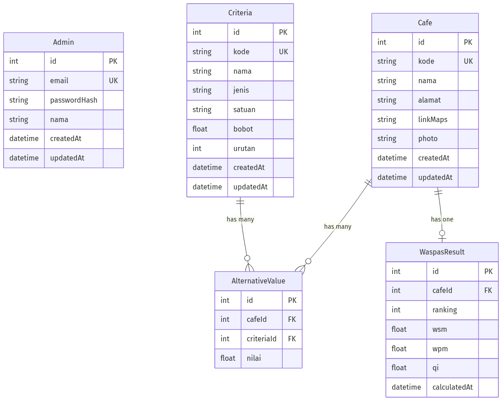

# Entity Relationship Diagram (ERD)

Diagram relasional database backend SPK WASPAS.

## Entitas & Atribut

### Admin
| Field | Type | Constraint | Keterangan |
|---|---|---|---|
| id | int | PK, autoincrement | |
| email | string | unique, not null | Login identifier |
| passwordHash | string | not null | bcrypt hash |
| nama | string | not null | Display name |
| createdAt | datetime | default now() | |
| updatedAt | datetime | auto-update | |

### Cafe
| Field | Type | Constraint | Keterangan |
|---|---|---|---|
| id | int | PK, autoincrement | |
| kode | string | unique, not null | e.g. `A1`, max 10 char |
| nama | string | not null | |
| alamat | string | not null | |
| linkMaps | string | nullable | URL Google Maps |
| photo | string | nullable | URL foto cafe |
| createdAt | datetime | default now() | |
| updatedAt | datetime | auto-update | |

### Criteria
| Field | Type | Constraint | Keterangan |
|---|---|---|---|
| id | int | PK, autoincrement | |
| kode | string | unique, not null | e.g. `K1` |
| nama | string | not null | |
| jenis | string | not null | `"benefit"` atau `"cost"` (validated app-level) |
| satuan | string | nullable | e.g. `Mbps`, `Rp` |
| bobot | float | default 0 | Total semua bobot HARUS = 1.0 (BR-01) |
| urutan | int | not null | Display order ascending |
| createdAt | datetime | default now() | |
| updatedAt | datetime | auto-update | |

### AlternativeValue
| Field | Type | Constraint | Keterangan |
|---|---|---|---|
| id | int | PK, autoincrement | |
| cafeId | int | FK → Cafe.id, not null | ON DELETE CASCADE |
| criteriaId | int | FK → Criteria.id, not null | ON DELETE CASCADE |
| nilai | float | not null | Raw survey value, ≥ 0 |

**Constraints:**
- `UNIQUE(cafeId, criteriaId)` — 1 nilai per (cafe, criteria)

### WaspasResult
| Field | Type | Constraint | Keterangan |
|---|---|---|---|
| id | int | PK, autoincrement | |
| cafeId | int | FK → Cafe.id, unique, not null | 1 row per cafe; ON DELETE CASCADE |
| ranking | int | not null | Integer 1..N (BR-07) |
| wsm | float | not null | Weighted Sum Model value |
| wpm | float | not null | Weighted Product Model value |
| qi | float | not null | `0.5 * WSM + 0.5 * WPM` |
| calculatedAt | datetime | default now() | Timestamp hitungan terakhir |

**Constraints:**
- `UNIQUE(cafeId)` — UPSERT on recalculate (BR-04)

---

## Relasi

| From | Cardinality | To | Deskripsi |
|---|---|---|---|
| Cafe | 1 — N | AlternativeValue | 1 cafe punya banyak nilai (1 per kriteria) |
| Criteria | 1 — N | AlternativeValue | 1 kriteria punya banyak nilai (1 per cafe) |
| Cafe | 1 — 1 | WaspasResult | 1 cafe punya 1 row ranking cache |

## Cascade Behavior

- Hapus **Cafe** → cascade hapus semua `AlternativeValue` + `WaspasResult` terkait
- Hapus **Criteria** → cascade hapus semua `AlternativeValue` terkait
- WaspasResult TIDAK boleh dihapus manual (hasil kalkulasi, selalu overwrite via UPSERT)

## Business Rules (DB-level enforced)

- `BR-01`: Total bobot `Criteria` = 1.0 — enforced app-level via `bobotValidator`
- `BR-04`: UPSERT `WaspasResult` per `cafeId` — enforced via `@@unique([cafeId])`
- `BR-07`: `ranking` integer 1..N — enforced app-level via sort + assign

## Sumber

- Schema: [`prisma/schema.prisma`](../prisma/schema.prisma)
- Migration SQL: [`prisma/migrations/20260625000000_init_postgres/migration.sql`](../prisma/migrations/20260625000000_init_postgres/migration.sql)
- Source Mermaid: [`erd.mmd`](./erd.mmd)